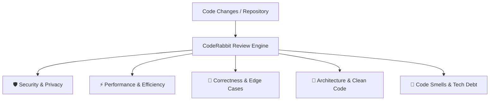

# CodeRabbit Autonomous Code Review Engine

The **CodeRabbit Review** skill performs automated, contextual, multi-dimensional code reviews on changed files, diffs, or entire repositories. It provides actionable feedback, catches edge cases, identifies security vulnerabilities, and highlights performance bottlenecks.

---

## 5 Review Dimensions



### 1. 🛡️ Security & Privacy
- **Injection Attacks**: SQL injection, command injection, XSS, template injection.
- **Secrets & Credentials**: Hardcoded API keys, tokens, passwords, private endpoints.
- **Authorization & Auth**: Missing access checks, IDOR, insecure direct object references.
- **Input Validation**: Unsanitized parameters, deserialization vulnerabilities.

### 2. ⚡ Performance & Efficiency
- **Time Complexity**: Unintentional $O(N^2)$ loops, nested searches over large collections.
- **Resource Management**: Unclosed file handles, database connections, memory leaks.
- **Caching & Duplication**: Repeated expensive computations, unmemoized functions.
- **Database / I/O**: N+1 queries, unindexed filters, blocking calls in async event loops.

### 3. 🧪 Correctness & Edge Cases
- **Null / Undefined Handling**: `AttributeError: 'NoneType'`, undefined property access.
- **Off-by-One Errors**: Boundary conditions in slicing, loops, range bounds.
- **Concurrency / Race Conditions**: Shared mutable state without locks.
- **Error Handling**: Silent failures, swallowed exceptions, unhandled Promise rejections.

### 4. 📐 Architecture & Clean Code
- **SOLID Principles**: Single responsibility, clear interfaces, dependency inversion.
- **DRY & Modularity**: Reusable helpers, minimal duplication.
- **Naming & Readability**: Descriptive variable/function names, self-documenting logic.

### 5. 🧹 Code Smells & Tech Debt
- **Dead Code**: Unused imports, unreachable blocks, obsolete variables.
- **Complexity**: Deeply nested conditionals, long functions (>50 lines).
- **Hardcoded Magic Values**: Unexplained magic numbers or strings.

---

## CodeRabbit Review Report Template

When generating a CodeRabbit review, structure the output using this standard format:

```markdown
# 🐇 CodeRabbit Review Summary

### 🎯 High-Level Overview
Brief 2-3 sentence executive summary of the changes and overall quality score.

---

### 🔍 Key Findings by Severity

#### 🔴 Critical / High (Action Required)
- **[File & Line Link]**: Description of vulnerability or crash risk.
  ```diff
  - problematic line
  + recommended fix
  ```

#### 🟡 Medium / Optimization (Recommended)
- **[File & Line Link]**: Performance improvement or edge-case handling suggestion.

#### 🟢 Low / Nitpicks (Optional)
- **[File & Line Link]**: Style, naming, or minor documentation cleanup.

---

### 🌟 Commendations
- Highlights of what was done particularly well (e.g. good test coverage, clean modularity).

### 🏁 Verdict
**[ APPROVE | REQUEST CHANGES | COMMENT ]**
```
