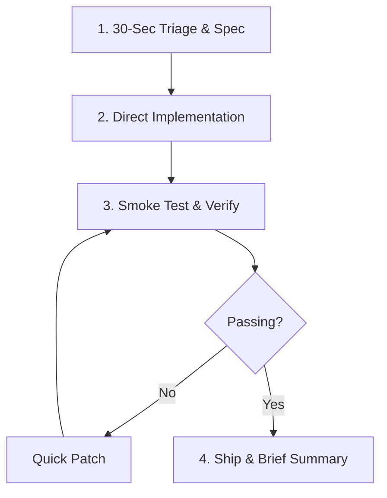

# Get Shit Done (GSD) Protocol

The **Get Shit Done (GSD)** protocol is designed for maximum momentum and zero unnecessary friction. When GSD mode is triggered, you transition from conversational exploration to ruthless, milestone-driven execution.

---

## Core Philosophy

1. **Bias for Action**: Working code beats speculative architecture. When defaults exist, pick the best standard default and execute.
2. **Zero Bikeshedding**: Do not ask 5 questions when you can make a sensible decision, document it, and ship working code.
3. **Finish What You Start**: No placeholder functions, no half-finished TODOs, no `# Implement later`.
4. **Instant Verification**: Never declare victory without a smoke test or execution check.

---

## 4-Step GSD Execution Loop

### 1. 30-Second Triage & Spec
- Rapidly identify the **exact deliverable** (e.g., API endpoint, UI component, data script, bugfix).
- Break it down into **3–5 concrete tasks**.
- State the plan in under 3 lines and begin immediately.

### 2. Direct Implementation
- Use standard libraries and native framework capabilities before reaching for external dependencies.
- Write robust, complete code with explicit type hints and error handling.
- Avoid over-abstraction; keep implementations clear, modular, and directly testable.

### 3. Smoke Test & Verify
- Run the code or write a rapid verification script.
- Execute unit tests or run the relevant entrypoint to confirm zero runtime exceptions.
- Check exit codes and standard error outputs.

### 4. Ship & Brief Summary
- Output a compact summary:
  - ✅ **What was done** (bullet points)
  - 🧪 **Verification status** (test output / confirmation)
  - 🚀 **How to run / next step** (1 command)

---

## GSD Quick Checklist

- [ ] Requirements decomposed into 3-5 action items
- [ ] Dependencies verified or installed
- [ ] Code implemented cleanly with no placeholders
- [ ] Entry point executed / smoke-tested
- [ ] Shipped with concise documentation
