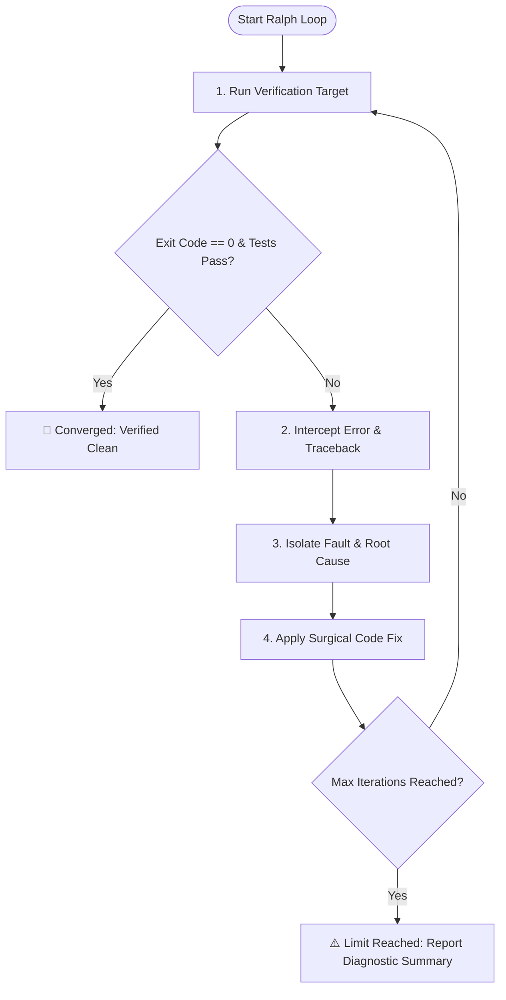

# Ralph Loop: Autonomous Self-Healing Execution Engine

The **Ralph Loop** is a continuous, closed-loop feedback mechanism for Antigravity. It repeatedly runs verification targets, catches runtime errors or test failures, performs root cause diagnosis, applies surgical patches, and re-executes until all tests pass or convergence is achieved.

---

## The Ralph Loop Architecture

---

## Operational Steps

### 1. Identify Target & Parameters
- **Target Command**: e.g., `pytest`, `python run_analysis.py`, `npm test`, `npm run build`.
- **Max Iterations**: Default `5` (configurable up to `10`).
- **Success Criteria**: Zero exit code, all test assertions green, zero uncaught exceptions.

### 2. Execution & Telemetry Capture
- Run the target command using `run_command`.
- Capture full telemetry:
  - Return code / Exit status
  - Full stack traces and exception types
  - Standard error (`stderr`) and output logs (`stdout`)

### 3. Error Classification & Diagnosis
Classify the failure into one of the following categories:
- **Syntax / Parse Error**: Unterminated strings, invalid syntax, mismatched brackets.
- **Import / Dependency Error**: Missing package, circular import, moved symbol.
- **Type / Attribute Error**: `NoneType` access, missing method, incorrect argument types.
- **Logic / Assertion Failure**: Incorrect calculation, failed unit test assertion, off-by-one error.
- **Environment / Resource Error**: File not found, permission denied, port conflict.

### 4. Surgical Patching
- Locate the exact file and line number from the traceback.
- Formulate a minimal, targeted patch addressing the root cause.
- Use `replace_file_content` or `multi_replace_file_content` to apply the fix.
- **Rule**: Never delete test assertions or suppress exceptions with blanket `except: pass` to bypass failures.

### 5. Re-Run & Convergence Evaluation
- Re-run the target command immediately.
- If it passes, exit the loop with success.
- If it fails with a different or remaining error, increment iteration count and repeat Step 3.

### 6. Emit Ralph Loop Summary
Output a structured summary:
- 🔁 **Total Iterations**: (e.g. 2 / 5)
- 🛠️ **Fixed Issues**:
  - Iteration 1: `Fix TypeError in calculate_scores() at run_analysis.py:84`
  - Iteration 2: `Add missing fallback in parse_config() at config.py:32`
- 🟢 **Final Verification**: `All tests passing (100% green)`
